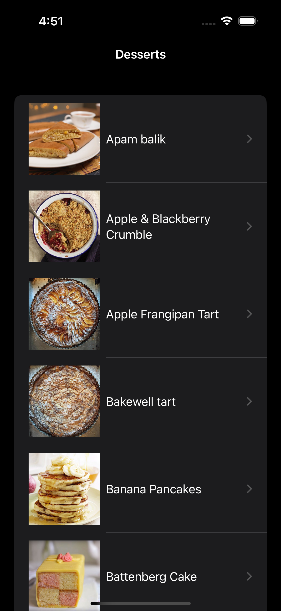
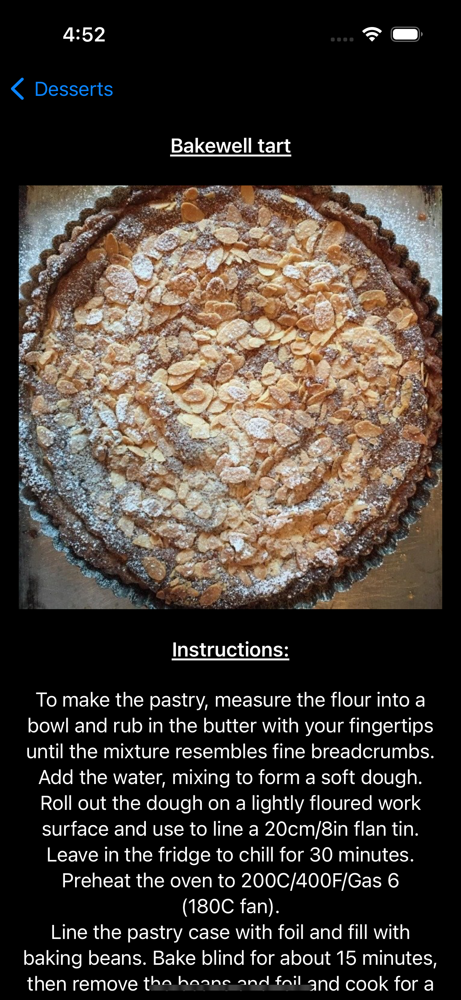

### Screenshots

|  |  |  |
| - | - | - |
|  |  |    |

### Code Explain

1. The project adopts the MVVM architecture.

2. Generics are used to make code reusable across similar data models.

3. Each SwiftUI view has a preview.

4. Utilizing Swift protocols for network client mocking.

